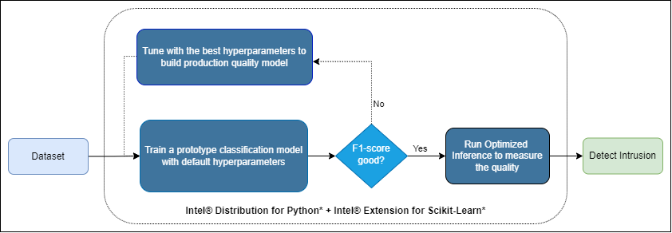

# **Network Intrusion Detection**


## **Table of Contents**
 - [Purpose](#purpose)
 - [Reference Solution](#reference-solution)
 - [Reference Implementation](#reference-implementation)
 - [Intel Optimized Reference Implementation](#optimized-e2e-architecture-with-intel®-oneapi-components)
 - [Performance Observations](#performance-observations)

## **Purpose**
Cyberattacks are escalating at a staggering rate globally. Intrusion prevention systems continuously monitor network traffic, looking for possible malicious incidents, containing the threat and capturing information about them, further reporting such information to system administrators, and improving preventative action. With the changing patterns in network behaviour, it is necessary to use a dynamic approach to detect and prevent such intrusions. A lot of research has been devoted to this field, and there is a universal acceptance that static datasets do not capture traffic compositions and interventions. It is needed the modifiable, reproducible, and extensible dataset to learn and tackle sophisticated attackers who can easily bypass basic intrusion detection systems (IDS). This is where machine learning comes into play but the continue used of ML models comes with impacts on TCO for these types of solutions.  

In this example, we highlight the difference between using Intel® oneAPI packages against the stock version of the same packages. It's been used as a Machine Learning based model to build a Network Intrusion Detection based on the LUFlow dataset using SVC.
The time required for training the model, inference time, and the F1_score of the model is captured for multiple runs on the stock version as well on the Intel® oneAPI version. The average of these runs is considered and comparisons have been provided

This document covers the below parts of the analysis as given below.
- Environment setup 
- Analyse training time performance for Intel® oneAPI Scikit-learnEx (with/without hyperparameters tuning)
- Prediction analysis

## **Reference Solution**

A network-based intrusion detection system (NIDS) is used to monitor and analyze network traffic to protect a system from network-based threats. A NIDS reads all inbound packets and searches for any suspicious patterns. When threats are discovered, based on their severity, the system could take action such as notifying administrators, or barring the source IP address from accessing the network. The experiment aimed to build a Network Intrusion Detection System that detects any network intrusions. The main aim of a Network Intrusion Detection System (NIDS) is to alert a system administrator each time an intruder tries to intrude into the network using a supervised learning algorithm (NuSVC). The goal is to train a classification model to classify the input data as benign, malicious, or outlier. As classification analysis is an exploratory task, an analyst will often run on different datasets of different sizes, resulting in different insights that they may use for decisions all from the same raw dataset. The algorithm used for classification is NuSVC. The nu-support vector classifier (NuSVC) is similar to the SVC with the only difference being that the NuSVC classifier has a nu parameter to control the number of support vectors.
For training, we are passing 70% of the dataset for training, and for batch inferencing, we are using 30% of the remaining dataset.
The reference kit implementation is a reference solution to the described use case that includes 

  1. A reference E2E architecture to arrive at an AI solution with NuSVC from Scikit-learn
  2. An Optimized reference E2E architecture enabled with Intel® Extension for Scikit-learn* available as part of Intel® oneAPI AI toolkit optimizations 

## **Reference Implementation**

### ***E2E Architecture***
### **Use Case E2E flow**


### Expected Input-Output

**Input**                                 | **Output** |
| :---: | :---: |
| Telemetry data records          | For each type of intrusion(malignant,benign,outlier) $d$, the probability [0, 1] of the intrusion $d$ |

**Example Input**                                 | **Example Output** |
| :---: | :---: |
|values for avg_ipt, bytes_in, bytes_out, dest_ip, dest_port, entropy, num_pkts_out, num_pkts_in, proto, src_ip,	src_port,	time_end,	time_start,	total_entropy, label,	duration | {'Malignant': 0.778, 'Benign': 0.023, 'outlier': 0.176}


### ***Hyper-parameter Analysis***

In realistic scenarios, an analyst will run the same classification algorithm multiple times on the same dataset, scanning across different hyper-parameters.  To capture this, we measure the total amount of time it takes to generate classification results (F1_score) in loop hyper-parameters for a fixed algorithm, which we define as hyper-parameter analysis.  In practice, the results of each hyper-parameter analysis provide the analyst with many different clusters that they can take and further analyze.

### ***Dataset***

This reference kit is implemented to demonstrate an experiment LUFlow dataset from Kaggle and can be found at  https://www.kaggle.com/datasets/mryanm/luflow-network-intrusion-detection-data-set .
(2021.02.17.csv file is downloaded and saved to the data folder and used as a dataset in this reference kit.) Each row in the data set has values for avg_ipt, bytes_in, bytes_out, dest_ip, dest_port ,entropy ,num_pkts_out,num_pkts_in, proto,	src_ip,	src_port,	time_end,	time_start,	total_entropy, label,	duration. Based on these features, the Network Intrusion Detection System has been built to identify the type of intrusion. Rows with empty columns were deleted from the initial CSV file. Instructions for downloading the data for use can be found in the `data' folder.

### Notes
***Please see this data set's applicable license for terms and conditions. Intel® Corporation does not own the rights to this data set and does not confer any rights to it.***

### ***Software Requirements***

1. Python
2. Scikit-Learn

### Repository clone and Anaconda installation

```
git clone https://github.com/oneapi-src/network-intrusion-detection
```

Note that this reference kit implementation already provides the necessary scripts to set up the software requirements. To utilize these environment scripts, first, install Anaconda/Miniconda by following the instructions at the following link

https://docs.conda.io/projects/conda/en/latest/user-guide/install/index.html

### ***Solution setup***

The environment can be created by running the below command:
```
conda env create -f env/stock/networkintrusiondetection_stock.yml
```

**YAML file**                                 | **Environment Name** |  **Configuration** |
| :---: | :---: | :---: |
| `env/stock/networkintrusiondetection_stock.yml`             | `networkintrusiondetection_stock` | Python=3.9.7 with stock Scikit-Learn

For the workload implementation to arrive at the first level solution we will be using the stock environment

### ***Optimized E2E architecture with Intel® oneAPI components***



### **Optimized software components**

#### ***Intel® Extension for SciKit-Learn****

Intel Extension for Scikit-learn uses the Intel® oneAPI Data Analytics Library (oneDAL) to achieve its acceleration. This library enables all the latest vector instructions, such as the Intel Advanced Vector Extensions (Intel AVX-512). It also uses cache-friendly data blocking, fast BLAS operations with the Intel® oneAPI Math Kernel Library (oneMKL), and scalable multithreading with the Intel® oneAPI Threading Building Blocks (oneTBB).

### **Optimized Solution setup**

Follow the below conda installation commands to set up the Intel environment along with the necessary packages for this model training and prediction. 
```sh
conda env create -f env/intel/networkintrusiondetection_intel.yml
```

**Activate conda environment for intel version**
Use the following command to activate the environment that was created:
```sh
conda activate networkintrusiondetection_intel
```
This script utilizes the dependencies found in the `env/intel/networkintrusiondetection_intel.yml` file to create an environment as follows:

**YAML file**                                 | **Environment Name** |  **Configuration** |
| :---: | :---: | :---: |
`env/intel/networkintrusiondetection_intel.yml`             | `networkintrusiondetection_intel` | Intel Python=3.9.7 with Intel® Extension for Scikit-learn*  |

## **Jupyter Notebook Demo**
You can directly access the Jupyter notebook shared in this repo [here](GettingStarted.ipynb).

To launch your own instance, activate either one of the `stock` or `intel` environments created in this readme and execute the following command.
```sh
jupyter notebook
```

Open `GettingStarted.ipynb` and follow the instructions there to perform training and inference on both the Stock and Intel optimized solutions.

### **Performance Observations**

We investigate the amount of time taken to perform hyper-parameter analysis under a combination of gamma (1e-4) and kernels (rbf, poly).

As classification analysis is an exploratory task, an analyst will often run on a different dataset of different sizes, resulting in different insights that they may use for decisions all from the same raw dataset.

For demonstrational purposes of the scaling of Intel® Extension for SciKit-learn*, we benchmark a full classification analysis using the 300k dataset size for training. Inference benchmark is made on NuSVC model trained with 300k dataset, using the realtime and batch size of 25k.

We summarize the benchmarking results comparing the Intel® technologies vs the stock alternative on the following tasks:
  
  1. Training with best tuned hyperparameters
  2. Inference

***Training***<br>

<br>**Key Takeaways**<br>Training time speedup with Intel® Extension for Scikit-learn 2021.6.0 shows up to 31.5x against stock Scikit-learn 1.0.2 for NuVC model with this dataset.


***Inference***<br>

<br>**Key Takeaways**
- Realtime prediction time speedup with Intel® Extension for Scikit-learn 2021.6.0 shows up to 7.92x against stock Scikit-learn 1.0.2 for NuVC model.
- Batch prediction time speedup with Intel® Extension for Scikit-learn 2021.6.0 shows up to 28.46x against stock Scikit-learn 1.0.2 for NuVC model with the batch size of 25k records. 

### Conclusion
To build a Network Intrusion Detection System, Data Scientists will need to train models for substantial datasets and run inferences more frequently. The ability to accelerate training will allow them to train more frequently and achieve better F1_score. Besides training, faster speed in inference will allow them to provide Network Intrusion Detection in real-time scenarios as well as more frequently. This reference kit implementation provides a performance-optimized guide around Network Intrusion Detection use cases that can be easily scaled across similar use cases.

### Notes
***Please see this data set's applicable license for terms and conditions. Intel® does not own the rights to this data set and does not confer any rights to it.***

###Notices & Disclaimers
Performance varies by use, configuration, and other factors. Learn more on the [Performance Index site](https://edc.intel.com/content/www/us/en/products/performance/benchmarks/overview/). 
Performance results are based on testing as of dates shown in configurations and may not reflect all publicly available updates.  See backup for configuration details.  No product or component can be absolutely secure. 
Your costs and results may vary. 
Intel technologies may require enabled hardware, software, or service activation.
© Intel Corporation.  Intel, the Intel logo, and other Intel marks are trademarks of Intel Corporation or its subsidiaries.  Other names and brands may be claimed as the property of others.  

## Appendix

**Date Testing Performed**: October 2022 

**Configuration Details and Workload Setup**: Azure Standard_D4_v5 (Intel(R) Xeon(R) Platinum 8370C CPU @ 2.80GHz), 1 Socket, 2 Cores per Socket, 2 Threads per Core, Turbo: On, 16 GB total memory, Ubuntu 20.04.4 LTS, Kernel: Linux 5.13.0-1025-azure x86_64,
Framework/Toolkit incl version for Stock: Python 3.9.7, scikit-learn_1.0.2, Framework/Toolkit incl version for Intel: Intel Python 3.9.7 2022.2.0, scikit-learn-intelex 2021.6.0, ML algorithm: NuSVC algorithm, Dataset size: 593843
, Number of Features: 15, Batch Size used for Inference Time Benchmark: 25k, Default NuSVC params: {'break_ties': False, 'cache_size': 200, 'class_weight': None, 'coef0': 0.0, 'decision_function_shape': 'ovr', 'degree': 3, 'gamma': 'scale', 'kernel': 'rbf', 'max_iter': -1, 'nu': 0.2, 'probability': False, 'random_state': None, 'shrinking': True, 'tol': 0.001, 'verbose': False},
Dataset Size used for Training Time Benchmark: 300k, Precision: FP32

**Testing performed by** Intel Corporation

### **Experiment setup**
| Platform                          | Microsoft Azure:Standard_D4_v5 (Ice Lake)<br>Ubuntu 20.04
| :---                              | :---
| Hardware                          | Intel IceLake CPU
| Software                          | Intel® oneAPI AI Analytics Toolkit, scikit-learn, pandas
| What you will learn               | Intel® oneAPI performance advantage over the vanilla versions
